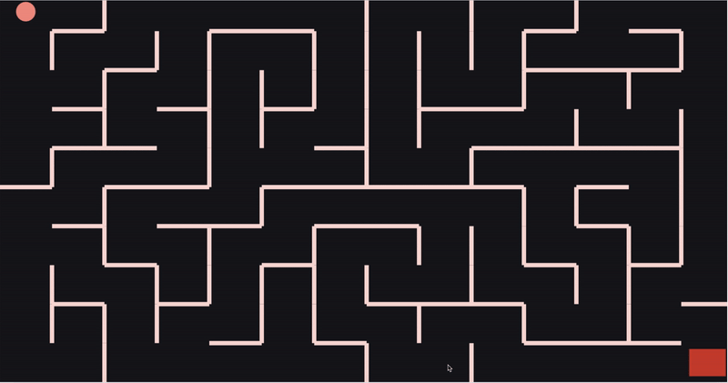

# Maze Game App

Maze Game built with Matter JS.

## Short demo:

## Tech Stack

- JavaScript
- Matter.js
- HTML5
- CSS3

## Installation

1. `git clone git@github.com:dorabelme/Maze-Game.git`
2. Open `index.html` to access the site.
